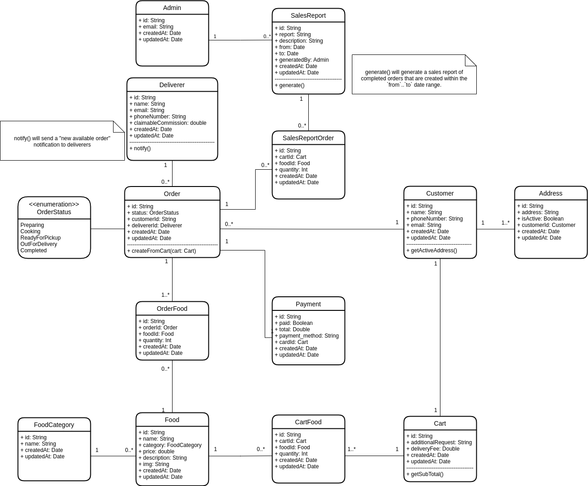

# LNN 4 Bert's (In memory of Bert's ✊😔)



All models in [/app/Models](./app/Models)

Seeders(to populate database with mock data) in [/database/seeders](./database/seeders)

## Scripts for presentation

  Show Admins

  ```php
  $admins = \App\Models\Admin::all();
  $admin = $admins->random();
  ```

  Show Sales Reports

  ```php
  $salesReports = \App\Models\SalesReport::all();
  $report = $salesReports->random();

  // Show which admin generated the report
  $report->generatedBy

  // Show orders in the report's date range
  $report->orders
  ```

  Show Customers

  ```php
  $customers = \App\Models\Customer::all();
  $customer = $customers->random();

  $customer->addresses;
  $customer->active_address;

  $customer->cart
  $customer->cart->sub_total
  $customer->cart->foods

  $customer->orders
  $customer->orders->where('status', 'Preparing')->first()->deliverer
  $customer->orders->where('status', 'OutForDelivery')->first()->deliverer
  ```

  Show Foods

  ```php
  $food = \App\Models\Food::find(1);
  $food->category
  ```

  Show notify

  ```php
  $order = \App\Models\Order::where('status', 'ReadyForPickup')
  \App\Models\Deliverer::notify($order)
  ```
